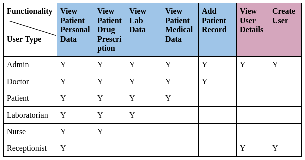
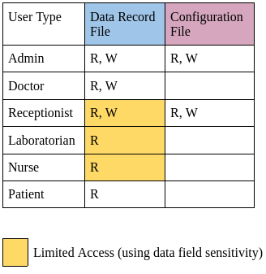
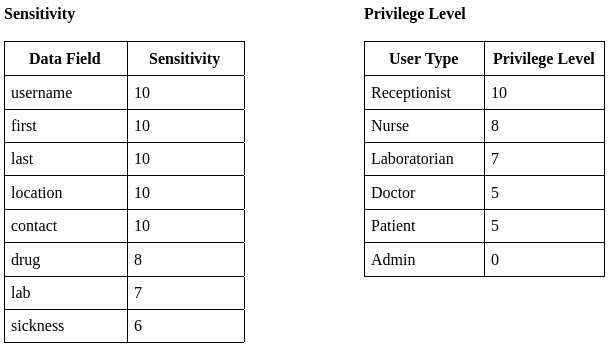

# Access Policy

The users have to login to the system first. If the user is authenticated, based on the <username> the system will identify the user’s privilege level. Privilege level defines which sensitive data can be accessed by that particular user and whether the user has read/write permissions.

## Access Control List

## Data Sensitivity and Privilege Levels

The sensitivity value given below is inverse to the actual sensitivity. The lower the value the higher the sensitivity.
Privilege level is given based on the sensitivity value. A user can view data with the same privilege value or higher.

